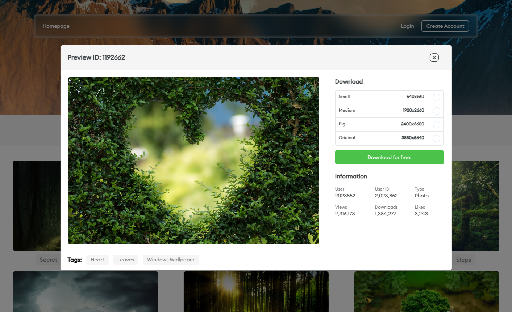

# React Frontend Project: [ImageVista](https://image-finders.netlify.app/)

This project is a React-based frontend application that leverages the Pixabay API to fetch images and display them on three different screens: the home page, search result page, and a modal image detail page. The application is designed to be responsive, ensuring a seamless experience across various devices.


## Screens:

1. **Home Page:**

   - Displays a dynamic background image that changes dynamically.
   - Responsive design for optimal viewing on different devices.

  
   
   

1. **Search Result Page:**

   - Features a responsive search bar for user input.
   - Displays search results in a responsive layout.
   - Includes a loading animation while fetching images from the Pixabay API.


1. **Modal Image Detail Page:**
   - Responsive design for desktop, tablet and mobile users.
   - Provides a detailed view of the selected image.
   - Allows users to download the image.




## Features:

- **Dynamic Background Image:**

  - Added the ability to dynamically change the background image.

- **Font and Text Improvements:**

  - Incorporated the Euclid font and fixed text overflow issues.
  - Capitalized essential text where needed.

- **Responsive Modal Design:**

  - Designed a responsive modal for displaying image details.

- **LocalStorage Integration:**

  - Implemented a LocalStorage hook to save search history.
  - Enables the retrieval of search history and handles click events on tags.

- **Loading Animation:**

  - Added a loading animation during image fetching from the Pixabay API.

- **Search Functionality:**

  - Integrated a search bar and implemented image fetching functionality.

- **Trending Bar:**

  - Designed a responsive trending bar on the home page.

- **Navbar Component:**
  - Created a responsive navbar component.

## Installation:

1. Clone or download the repository:

   Download the zip folder or clone

2. Navigate to roc8-assignment-1

   ```bash
   cd roc8-assignment-1
   ```

3. Install Dependencies

   ```bash
   npm install
   ```

4. Run the application

   ```bash
   npm run dev
   ```

   This will start the development server, and you can access the application at http://localhost:5173.

5. Create .env file in the root (Provided .env.example)

## Check out live project [website](https://image-finders.netlify.app/)
